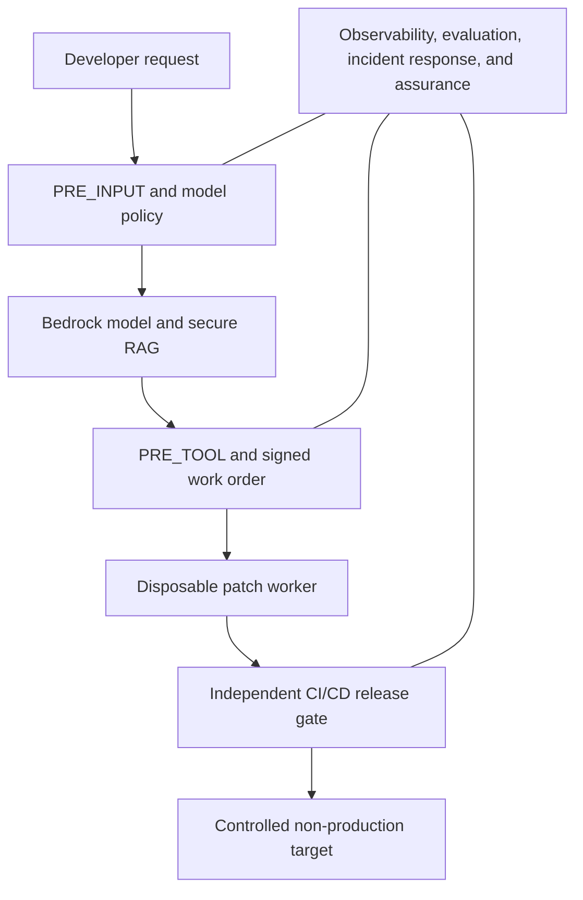

# AWS Bedrock Secure Coding Agent Security

## Instructor Training and Study Guide — Chapters 1–14

> A practical AppSec, CI/CD, and agent-security course for the fictional Northstar Health Systems.

**Repository:** [kolajoseph87/aws-bedrock-agent-security-lab](https://github.com/kolajoseph87/aws-bedrock-agent-security-lab)

**Validated source:** commit `02e47da`

**Training boundary:** synthetic data, non-production use, and disabled-by-default infrastructure.

---

## Purpose and audience

This guide helps instructors teach security engineers, developers, cloud engineers, students, auditors, and technical leaders how to control an Amazon Bedrock–powered Secure Coding Agent. The course focuses on application security, CI/CD security, software supply-chain security, healthcare privacy, and safe agent operations.

Northstar Health Systems is fictional. All patient-like examples are synthetic. The course must never use real PHI, PII, production source code, live credentials, or production authority.

## Course outcomes

By the end of the course, learners should be able to:

- Threat-model an agentic coding workflow.
- Separate network access, identity, model approval, and action authorization.
- Protect PHI, PII, credentials, source code, prompts, retrieved text, and evidence.
- Enforce runtime policy before model calls, tools, and output release.
- Isolate code execution and independently govern CI/CD releases.
- Detect attacks without logging sensitive bodies.
- Run harmless security evaluations and respond to incidents.
- Secure multi-agent delegation and create an evidence-backed assurance case.
- Validate the complete system in a controlled non-production capstone.

## Instructor use

Each chapter contains learning objectives, a Northstar scenario, core concepts, a control flow, a guided lab, safe exercises, required evidence, knowledge checks, instructor notes, key takeaways, a security checklist, common failure modes, and limitations. A useful teaching rhythm is:

1. Introduce the scenario and ask learners what could fail.
2. Teach the controls and the boundaries between them.
3. Run the offline validator and cumulative tests.
4. Change a copy of the manifest to create one harmless failure.
5. Review the denial reason and confirm zero prohibited side effects.
6. Collect sanitized evidence and discuss what still requires live verification.

## Safety rules

- Use only the fictional Northstar scenario and synthetic fixtures.
- Never paste real PHI, PII, credentials, tokens, production prompts, production code, or patient records into the lab.
- Keep every infrastructure deployment disabled until separately reviewed in an approved non-production account.
- Treat every denial test as successful only when the prohibited side effect is also absent.
- Do not describe a passing educational lab as HIPAA compliance, production readiness, certification, or authorization.
- Verify current AWS availability, Regions, IAM behavior, quotas, lifecycle, and pricing before live use.

## Course map

| Chapter | Topic | Main security result |
|---:|---|---|
| 1 | Threat Modeling the Secure Coding Agent | Map the valuables, doors, callers, and forbidden outcomes before choosing controls. |
| 2 | Private Network Foundation | Keep the agent’s road private, narrow, and observable—and still check permission. |
| 3 | Bedrock Model Governance | Use an approved model, in an approved Region, with the smallest safe input—and check before every call. |
| 4 | Identity, KMS, and Secrets Security | Give every worker its own temporary badge, only the keys it needs, and no power to approve itself. |
| 5 | Runtime Policy Enforcement | Check before thinking. Check before doing. Check before sharing. |
| 6 | Secure Retrieval-Augmented Generation | Approve the shelf, verify the book, inspect every page, and never obey instructions hidden inside retrieved text. |
| 7 | Isolated Tool Execution | Let the agent request an action; let a separate, disposable worker perform only the exact approved action. |
| 8 | CI/CD and Software Supply-Chain Security | The agent may propose the patch; an independent pipeline must prove and approve what ships. |
| 9 | Privacy-Safe Observability and Detection | Observe every decision, expose no sensitive body, and alert when trusted behavior changes. |
| 10 | Red Teaming and Security Evaluations | Test like an attacker, but give the evaluator no production data, production authority, or path to real side effects. |
| 11 | Incident Response and Recovery | Stop the agent first, preserve trustworthy evidence second, recover only after independent verification. |
| 12 | Multi-Agent Security and Orchestration | Every agent gets its own identity, minimum authority, authenticated messages, and bounded delegation—trust never transfers automatically. |
| 13 | Compliance Assurance and Readiness | A control is not ready because it is documented; it must be mapped, implemented, tested, evidenced, owned, and independently approved. |
| 14 | Final Controlled Capstone | Validate the whole system under attack, preserve proof, remove temporary authority, and never confuse a successful lab with production authorization. |

## System view



The model can recommend. It cannot grant itself authority. Deterministic policy, isolated workers, independent pipelines, human approvals, monitoring, and incident controls decide what may happen.

## Suggested delivery plan

| Session | Chapters | Focus | Suggested time |
|---:|---|---|---:|
| 1 | 1–2 | Threat model and private network foundation | 3 hours |
| 2 | 3–4 | Model governance, identities, encryption, and secrets | 3 hours |
| 3 | 5–6 | Runtime gates and secure RAG | 3 hours |
| 4 | 7–8 | Isolated execution and CI/CD supply chain | 3.5 hours |
| 5 | 9–10 | Observability and security evaluation | 3 hours |
| 6 | 11–12 | Incident response and multi-agent security | 3 hours |
| 7 | 13–14 | Assurance and capstone | 4 hours |

Allow additional time for discussion, environment preparation, and learner exercises.

---

# Chapter 1: Threat Modeling the Secure Coding Agent

> Map the valuables, doors, callers, and forbidden outcomes before choosing controls.

## Learning objectives

- Identify assets, actors, components, data flows, and trust boundaries.
- Use STRIDE to organize threats without treating it as a complete risk assessment.
- Turn threats into owned, testable security requirements.
- Define harmless abuse tests and residual-risk decisions.

## Why this matters at Northstar

Northstar Health Systems wants an AI coding assistant to review a patient-portal training repository. Before adding technology, the team must understand what can go wrong, which data and systems matter, and who owns each risk.

## Core concepts

| Term | Meaning |
|---|---|
| **Asset** | Something valuable, such as source code, a policy decision, an audit record, or a deployment credential. |
| **Trust boundary** | A place where data or authority moves between systems with different trust levels. |
| **Threat** | A possible harmful event, such as forged identity, unauthorized retrieval, or pipeline bypass. |
| **Mitigation** | A control that reduces the likelihood or impact of a threat. |
| **Residual risk** | Risk that remains after controls are applied and must be owned and treated. |

## Control flow

1. List the system’s assets and owners.
2. Draw the people, services, repositories, models, tools, and data stores.
3. Mark every trust boundary and data flow.
4. Apply STRIDE and healthcare privacy questions.
5. Create a requirement and a negative test for each important threat.
6. Assign an owner and treatment to remaining risk.

## Healthcare AppSec example

A pull request contains a hidden instruction telling the agent to ignore policy and reveal a build credential. The threat model shows that repository content crosses an untrusted boundary, so it must be treated as data, scanned, and prevented from granting authority.

## Guided lab

### Lab goal

Validate the Chapter 1 security contract, run all cumulative regression tests, and confirm that generated evidence is excluded from Git.

### Files used

- Lesson: `docs/CHAPTER-1.md`
- Manifest: `threat-model/threat-model.json`
- Validator: `scripts/validate_threat_model.py`
- Evidence checklist: `evidence/README.md`
- Generated evidence: `evidence/lab-1-validation.json`

### Commands

```bash
python3 scripts/validate_threat_model.py \
  --manifest threat-model/threat-model.json \
  --evidence evidence/lab-1-validation.json

python3 -m unittest discover -s tests -v
python3 -m compileall scripts tests python
```

### What learners should observe

- The validator reports each required security contract as a pass or a clear failure.
- The cumulative unit suite protects earlier chapters from regression.
- Python compilation completes without syntax errors.
- The generated JSON evidence remains ignored by Git.
- Offline validation makes no AWS or Bedrock call and causes no repository, release, deployment, or patient-data side effect.

### Safe practice exercises

- Prompt claims to be a security administrator.
- A request asks for code outside the approved repository.
- A pull request tries to bypass a required security gate.
- A threat is entered without an owner or test.
- A residual risk is marked accepted without a treatment.

For each exercise, change only a disposable copy of the manifest or test fixture. Predict the failure, run the validator, record the reason code, and confirm the protected action did not occur.

## Evidence to retain

- Reviewed threat-model manifest and diagram
- Named owners for assets, threats, and residual risks
- Traceability from threat to mitigation and test
- Sanitized validator output and evidence digest
- Evidence must contain safe identifiers, hashes, versions, results, timestamps, and owners—not sensitive bodies.

## Instructor notes

- Start with the chapter lesson: “Map the valuables, doors, callers, and forbidden outcomes before choosing controls.”
- Ask learners to identify which control makes the decision and which controls only provide supporting protection.
- Emphasize that a private path, encrypted value, model response, log entry, or passing test does not create business authorization.
- Ask learners to state the prohibited side effect for every negative test.
- End by identifying what the offline lab proves and what requires a live non-production test.

## Knowledge check

1. **Why mark trust boundaries?**
   - They show where identity, data, or authority must be checked again.
2. **Does a threat model prove the system is secure?**
   - No. It creates testable requirements; implementation and evidence must follow.
3. **Who may accept residual risk?**
   - An accountable human with the required authority, not the agent.

## Key takeaways

- Map the valuables, doors, callers, and forbidden outcomes before choosing controls.
- Identify assets, actors, components, data flows, and trust boundaries.
- Define harmless abuse tests and residual-risk decisions.
- Security evidence must be version-bound, privacy-safe, and independently reviewable.

## Security checklist

- [ ] The control has a named owner and a clear protected outcome.
- [ ] Identity and scope come from trusted system context, not prompt claims.
- [ ] Sensitive data is prohibited or minimized before processing.
- [ ] The control fails closed when required policy or evidence is unavailable.
- [ ] Negative tests prove denial and zero prohibited side effects.
- [ ] Evidence is sanitized, version-bound, and excluded from ordinary source control when generated.
- [ ] Independent approval is required for irreversible or production-impacting actions.

## Common failure modes

- Starting with products instead of risks.
- Treating STRIDE as proof that every threat was found.
- Leaving threats without owners or acceptance criteria.
- Trusting prompt-supplied identity or scope.
- Recording real patient information in diagrams or evidence.

## What this chapter does not prove

Passing Chapter 1 proves that the documented offline contract and tests passed for the files that were evaluated. It does not prove current AWS configuration, model behavior, operational readiness, HIPAA compliance, or permission to process real patient data. Those claims require live non-production evidence, organizational review, and separate authorization.

---

# Chapter 2: Private Network Foundation

> Keep the agent’s road private, narrow, and observable—and still check permission.

## Learning objectives

- Separate agent, worker, and endpoint trust zones.
- Explain the difference between network reachability and authorization.
- Recognize unsafe public paths and broad egress.
- Validate a disabled-by-default network template.

## Why this matters at Northstar

The coding agent, policy service, worker, and AWS services need network paths. Northstar reduces exposure by using private subnets, separate trust zones, private service endpoints, and controlled egress.

## Core concepts

| Term | Meaning |
|---|---|
| **Private subnet** | A subnet without a direct route to an Internet Gateway. |
| **VPC endpoint** | A private path from a VPC to a supported AWS service. |
| **Endpoint policy** | A resource policy that limits use through an endpoint; it is not a replacement for IAM. |
| **Security group** | A stateful network rule set; it does not inspect PHI, PII, or prompt content. |
| **Controlled egress** | Outbound access restricted to approved destinations and purposes. |

## Control flow

1. Use multiple Availability Zones.
2. Place the agent, disposable worker, and endpoints in separate private zones.
3. Remove public IPs, Internet Gateway routes, and unreviewed NAT paths.
4. Create the specific Bedrock and supporting-service endpoints that are required.
5. Use private DNS and restrictive endpoint policies.
6. Send safe flow evidence to independent monitoring.

## Healthcare AppSec example

A compromised build script attempts to connect to an unapproved Internet host. The worker has no default Internet route and its egress policy denies the connection. IAM and tool authorization still decide whether approved AWS calls may occur.

## Guided lab

### Lab goal

Validate the Chapter 2 security contract, run all cumulative regression tests, and confirm that generated evidence is excluded from Git.

### Files used

- Lesson: `docs/CHAPTER-2.md`
- Manifest: `network/landing-zone.aws.json`
- Validator: `scripts/validate_network.py`
- Evidence checklist: `evidence/LAB-2-CHECKLIST.md`
- Generated evidence: `evidence/lab-2-validation.json`

### Commands

```bash
python3 scripts/validate_network.py \
  --manifest network/landing-zone.aws.json \
  --evidence evidence/lab-2-validation.json

python3 -m unittest discover -s tests -v
python3 -m compileall scripts tests python
```

### What learners should observe

- The validator reports each required security contract as a pass or a clear failure.
- The cumulative unit suite protects earlier chapters from regression.
- Python compilation completes without syntax errors.
- The generated JSON evidence remains ignored by Git.
- Offline validation makes no AWS or Bedrock call and causes no repository, release, deployment, or patient-data side effect.

### Safe practice exercises

- Add a public IP to a workload.
- Add an Internet Gateway or default route.
- Enable broad worker egress.
- Use a full-access endpoint policy.
- Disable private DNS.
- Open a security group to the world.

For each exercise, change only a disposable copy of the manifest or test fixture. Predict the failure, run the validator, record the reason code, and confirm the protected action did not occur.

## Evidence to retain

- Subnet and route-table design
- Endpoint inventory and policy review
- Security-group flow matrix
- Negative tests for public access and broad egress
- Sanitized network evidence
- Evidence must contain safe identifiers, hashes, versions, results, timestamps, and owners—not sensitive bodies.

## Instructor notes

- Start with the chapter lesson: “Keep the agent’s road private, narrow, and observable—and still check permission.”
- Ask learners to identify which control makes the decision and which controls only provide supporting protection.
- Emphasize that a private path, encrypted value, model response, log entry, or passing test does not create business authorization.
- Ask learners to state the prohibited side effect for every negative test.
- End by identifying what the offline lab proves and what requires a live non-production test.

## Knowledge check

1. **Does PrivateLink authorize a model call?**
   - No. It protects the path; IAM and runtime policy authorize the action.
2. **Why separate the worker from the agent?**
   - They have different risks and permissions, so separation reduces blast radius.
3. **Can a security group detect patient data?**
   - No. Content controls must inspect data before and after processing.

## Key takeaways

- Keep the agent’s road private, narrow, and observable—and still check permission.
- Separate agent, worker, and endpoint trust zones.
- Validate a disabled-by-default network template.
- Security evidence must be version-bound, privacy-safe, and independently reviewable.

## Security checklist

- [ ] The control has a named owner and a clear protected outcome.
- [ ] Identity and scope come from trusted system context, not prompt claims.
- [ ] Sensitive data is prohibited or minimized before processing.
- [ ] The control fails closed when required policy or evidence is unavailable.
- [ ] Negative tests prove denial and zero prohibited side effects.
- [ ] Evidence is sanitized, version-bound, and excluded from ordinary source control when generated.
- [ ] Independent approval is required for irreversible or production-impacting actions.

## Common failure modes

- Assuming PrivateLink grants permission.
- Calling a subnet private while it has a public route.
- Using one Bedrock endpoint for every Bedrock API.
- Treating flow logs as content-aware DLP.
- Allowing broad egress because inbound traffic is blocked.

## What this chapter does not prove

Passing Chapter 2 proves that the documented offline contract and tests passed for the files that were evaluated. It does not prove current AWS configuration, model behavior, operational readiness, HIPAA compliance, or permission to process real patient data. Those claims require live non-production evidence, organizational review, and separate authorization.

---

# Chapter 3: Bedrock Model Governance

> Use an approved model, in an approved Region, with the smallest safe input—and check before every call.

## Learning objectives

- Build a default-deny approved-model catalog.
- Bind invocation to exact identity, purpose, model, Region, Guardrail, limits, and policy version.
- Minimize code context and block sensitive input.
- Manage model changes, drift, expiration, and rollback.

## Why this matters at Northstar

A model should not be selected simply because it is available. Northstar needs an approved catalog, exact model and Region restrictions, privacy gates, cost limits, change control, and regression tests.

## Core concepts

| Term | Meaning |
|---|---|
| **Model approval** | Permission to use one exact model for one approved purpose under stated conditions. |
| **Guardrail** | A defense-in-depth content control; it is not deterministic authorization or complete privacy protection. |
| **Cross-Region inference** | Routing that may process requests in additional Regions and needs separate review. |
| **Context minimization** | Sending only the code and instructions needed for the task. |
| **Regression evaluation** | Repeating approved tests after a model or policy change. |

## Control flow

1. Match the exact model ID and approved Region.
2. Verify approval owner, purpose, expiration, and risk review.
3. Reject cross-Region inference for this healthcare lab.
4. Scan the minimum input for PHI, PII, credentials, and scope violations.
5. Require the approved Guardrail and deterministic output checks.
6. Enforce token, cost, timeout, and logging rules.
7. Record a privacy-safe decision event.

## Healthcare AppSec example

A developer changes the model ID to a newer model without review. The pre-invocation policy denies the call because the exact identifier is not in the approved catalog. The team evaluates and approves changes independently.

## Guided lab

### Lab goal

Validate the Chapter 3 security contract, run all cumulative regression tests, and confirm that generated evidence is excluded from Git.

### Files used

- Lesson: `docs/CHAPTER-3.md`
- Manifest: `model-governance/model-governance.aws.json`
- Validator: `scripts/validate_model_governance.py`
- Evidence checklist: `evidence/LAB-3-CHECKLIST.md`
- Generated evidence: `evidence/lab-3-validation.json`

### Commands

```bash
python3 scripts/validate_model_governance.py \
  --manifest model-governance/model-governance.aws.json \
  --evidence evidence/lab-3-validation.json

python3 -m unittest discover -s tests -v
python3 -m compileall scripts tests python
```

### What learners should observe

- The validator reports each required security contract as a pass or a clear failure.
- The cumulative unit suite protects earlier chapters from regression.
- Python compilation completes without syntax errors.
- The generated JSON evidence remains ignored by Git.
- Offline validation makes no AWS or Bedrock call and causes no repository, release, deployment, or patient-data side effect.

### Safe practice exercises

- Substitute an unapproved model.
- Invoke from an unapproved Region.
- Remove the Guardrail identifier.
- Increase the context or token limit.
- Capture prompt and completion bodies in logs.
- Continue when the policy service is unavailable.

For each exercise, change only a disposable copy of the manifest or test fixture. Predict the failure, run the validator, record the reason code, and confirm the protected action did not occur.

## Evidence to retain

- Approved-model record with owner and expiration
- Synthetic evaluation results bound to versions
- Pre-invocation denial tests
- Logging configuration review
- Rollback and drift-detection plan
- Evidence must contain safe identifiers, hashes, versions, results, timestamps, and owners—not sensitive bodies.

## Instructor notes

- Start with the chapter lesson: “Use an approved model, in an approved Region, with the smallest safe input—and check before every call.”
- Ask learners to identify which control makes the decision and which controls only provide supporting protection.
- Emphasize that a private path, encrypted value, model response, log entry, or passing test does not create business authorization.
- Ask learners to state the prohibited side effect for every negative test.
- End by identifying what the offline lab proves and what requires a live non-production test.

## Knowledge check

1. **Does model approval authorize a repository write?**
   - No. Tool and repository actions need separate authorization.
2. **Why use exact model IDs?**
   - Exact IDs prevent silent substitution and make tests reproducible.
3. **What happens if policy is unavailable?**
   - The invocation fails closed.

## Key takeaways

- Use an approved model, in an approved Region, with the smallest safe input—and check before every call.
- Build a default-deny approved-model catalog.
- Manage model changes, drift, expiration, and rollback.
- Security evidence must be version-bound, privacy-safe, and independently reviewable.

## Security checklist

- [ ] The control has a named owner and a clear protected outcome.
- [ ] Identity and scope come from trusted system context, not prompt claims.
- [ ] Sensitive data is prohibited or minimized before processing.
- [ ] The control fails closed when required policy or evidence is unavailable.
- [ ] Negative tests prove denial and zero prohibited side effects.
- [ ] Evidence is sanitized, version-bound, and excluded from ordinary source control when generated.
- [ ] Independent approval is required for irreversible or production-impacting actions.

## Common failure modes

- Treating model availability as approval.
- Approving a model family instead of an exact ID.
- Logging full prompts and responses.
- Using Guardrails as the only PHI/PII control.
- Allowing model changes without independent review.

## What this chapter does not prove

Passing Chapter 3 proves that the documented offline contract and tests passed for the files that were evaluated. It does not prove current AWS configuration, model behavior, operational readiness, HIPAA compliance, or permission to process real patient data. Those claims require live non-production evidence, organizational review, and separate authorization.

---

# Chapter 4: Identity, KMS, and Secrets Security

> Give every worker its own temporary badge, only the keys it needs, and no power to approve itself.

## Learning objectives

- Separate authentication from authorization.
- Design distinct least-privileged workload roles.
- Use temporary credentials and restrict role trust.
- Keep secrets and sensitive encryption context out of prompts, logs, and evidence.

## Why this matters at Northstar

The Bedrock-facing application, isolated patch worker, and CI/CD gate do different jobs. Northstar separates their identities and uses temporary credentials, restricted trust, narrow permissions, and independent approval.

## Core concepts

| Term | Meaning |
|---|---|
| **Authentication** | Proof of who or what is calling. |
| **Authorization** | Decision about whether that caller may perform an exact action. |
| **Role trust policy** | Rules defining which principal may assume a role and under what conditions. |
| **Permissions boundary** | A maximum permission boundary; it does not grant permission by itself. |
| **Encryption context** | Non-secret key-value context used by KMS and visible in logs. |

## Control flow

1. Federate human users and require MFA.
2. Use separate agent, worker, and pipeline roles.
3. Issue short-lived credentials only.
4. Bind service trust with source-account and source-ARN protections.
5. Restrict iam:PassRole to exact roles and services.
6. Keep agent access away from secrets and direct decryption.
7. Rotate and revoke secrets independently.

## Healthcare AppSec example

The coding agent asks to read a database secret to troubleshoot a synthetic issue. Its role has no Secrets Manager permission and the runtime policy rejects secrets in model context. A separately authorized service performs any required secret use without revealing the value.

## Guided lab

### Lab goal

Validate the Chapter 4 security contract, run all cumulative regression tests, and confirm that generated evidence is excluded from Git.

### Files used

- Lesson: `docs/CHAPTER-4.md`
- Manifest: `identity-security/identity-kms-secrets.aws.json`
- Validator: `scripts/validate_identity_security.py`
- Evidence checklist: `evidence/LAB-4-CHECKLIST.md`
- Generated evidence: `evidence/lab-4-validation.json`

### Commands

```bash
python3 scripts/validate_identity_security.py \
  --manifest identity-security/identity-kms-secrets.aws.json \
  --evidence evidence/lab-4-validation.json

python3 -m unittest discover -s tests -v
python3 -m compileall scripts tests python
```

### What learners should observe

- The validator reports each required security contract as a pass or a clear failure.
- The cumulative unit suite protects earlier chapters from regression.
- Python compilation completes without syntax errors.
- The generated JSON evidence remains ignored by Git.
- Offline validation makes no AWS or Bedrock call and causes no repository, release, deployment, or patient-data side effect.

### Safe practice exercises

- Share one role across the agent and worker.
- Use a long-lived access key or Bedrock API key.
- Broaden iam:PassRole.
- Let the agent call Secrets Manager.
- Put patient identifiers in KMS encryption context.
- Let the requester approve the same change.

For each exercise, change only a disposable copy of the manifest or test fixture. Predict the failure, run the validator, record the reason code, and confirm the protected action did not occur.

## Evidence to retain

- Role-to-purpose matrix
- Trust and permission policy review
- IAM Access Analyzer and simulation results
- KMS separation review
- Secret rotation and revocation evidence
- Separation-of-duties approval record
- Evidence must contain safe identifiers, hashes, versions, results, timestamps, and owners—not sensitive bodies.

## Instructor notes

- Start with the chapter lesson: “Give every worker its own temporary badge, only the keys it needs, and no power to approve itself.”
- Ask learners to identify which control makes the decision and which controls only provide supporting protection.
- Emphasize that a private path, encrypted value, model response, log entry, or passing test does not create business authorization.
- Ask learners to state the prohibited side effect for every negative test.
- End by identifying what the offline lab proves and what requires a live non-production test.

## Knowledge check

1. **Why not share one role?**
   - Separate roles limit blast radius and make actions attributable.
2. **Is encryption context secret?**
   - No. It can appear in logs and must not contain PHI, PII, or secrets.
3. **Does a boundary grant access?**
   - No. An identity or resource policy must still allow the action.

## Key takeaways

- Give every worker its own temporary badge, only the keys it needs, and no power to approve itself.
- Separate authentication from authorization.
- Keep secrets and sensitive encryption context out of prompts, logs, and evidence.
- Security evidence must be version-bound, privacy-safe, and independently reviewable.

## Security checklist

- [ ] The control has a named owner and a clear protected outcome.
- [ ] Identity and scope come from trusted system context, not prompt claims.
- [ ] Sensitive data is prohibited or minimized before processing.
- [ ] The control fails closed when required policy or evidence is unavailable.
- [ ] Negative tests prove denial and zero prohibited side effects.
- [ ] Evidence is sanitized, version-bound, and excluded from ordinary source control when generated.
- [ ] Independent approval is required for irreversible or production-impacting actions.

## Common failure modes

- Sharing credentials between components.
- Believing encryption grants business permission.
- Using a permissions boundary as an allow policy.
- Passing secrets through prompts or environment variables.
- Giving the agent direct decryption or self-approval power.

## What this chapter does not prove

Passing Chapter 4 proves that the documented offline contract and tests passed for the files that were evaluated. It does not prove current AWS configuration, model behavior, operational readiness, HIPAA compliance, or permission to process real patient data. Those claims require live non-production evidence, organizational review, and separate authorization.

---

# Chapter 5: Runtime Policy Enforcement

> Check before thinking. Check before doing. Check before sharing.

## Learning objectives

- Apply PRE_INPUT, PRE_TOOL, and PRE_OUTPUT checks.
- Bind every tool decision to exact identity, scope, arguments, approval, and policy version.
- Fail closed with zero prohibited side effects.
- Use Guardrails as one layer, not the only security control.

## Why this matters at Northstar

The model can produce useful suggestions, but it must not decide its own authority. Northstar places deterministic gates around model input, tool requests, and released output.

## Core concepts

| Term | Meaning |
|---|---|
| **PRE_INPUT** | Checks identity, purpose, scope, and sensitive data before model inference. |
| **PRE_TOOL** | Authorizes the exact proposed tool, action, resource, and arguments before execution. |
| **PRE_OUTPUT** | Validates the complete buffered result before release. |
| **Return control** | Bedrock returns proposed action parameters to application code for inspection. |
| **Replay protection** | A short-lived, single-use decision cannot be reused for a later action. |

## Control flow

1. Derive identity and scope from trusted runtime context.
2. Reject unauthorized or sensitive input before inference.
3. Receive proposed tool parameters through return control.
4. Authorize exact caller, repository, action, resource, arguments, approval, expiry, nonce, and policy version.
5. Have the worker verify the signed decision again.
6. Buffer and scan the complete output before release.
7. Emit sanitized correlated evidence.

## Healthcare AppSec example

The agent proposes changing an approved file but quietly adds a pipeline file to the argument list. PRE_TOOL recomputes the argument hash, detects the mismatch, and denies the entire request before any worker runs.

## Guided lab

### Lab goal

Validate the Chapter 5 security contract, run all cumulative regression tests, and confirm that generated evidence is excluded from Git.

### Files used

- Lesson: `docs/CHAPTER-5.md`
- Manifest: `runtime-policy/runtime-policy.aws.json`
- Validator: `scripts/validate_runtime_policy.py`
- Evidence checklist: `evidence/LAB-5-CHECKLIST.md`
- Generated evidence: `evidence/lab-5-validation.json`

### Commands

```bash
python3 scripts/validate_runtime_policy.py \
  --manifest runtime-policy/runtime-policy.aws.json \
  --evidence evidence/lab-5-validation.json

python3 -m unittest discover -s tests -v
python3 -m compileall scripts tests python
```

### What learners should observe

- The validator reports each required security contract as a pass or a clear failure.
- The cumulative unit suite protects earlier chapters from regression.
- Python compilation completes without syntax errors.
- The generated JSON evidence remains ignored by Git.
- Offline validation makes no AWS or Bedrock call and causes no repository, release, deployment, or patient-data side effect.

### Safe practice exercises

- Put synthetic PHI or a fake credential in input.
- Claim a different repository in the prompt.
- Change tool arguments after approval.
- Replay an expired decision.
- Skip independent approval for a write.
- Stream output before the final scan.

For each exercise, change only a disposable copy of the manifest or test fixture. Predict the failure, run the validator, record the reason code, and confirm the protected action did not occur.

## Evidence to retain

- Versioned runtime-policy manifest
- Allow and deny decisions with reason codes
- Argument-hash and nonce tests
- Proof denied actions caused no worker or repository side effect
- Output-validation results
- Evidence must contain safe identifiers, hashes, versions, results, timestamps, and owners—not sensitive bodies.

## Instructor notes

- Start with the chapter lesson: “Check before thinking. Check before doing. Check before sharing.”
- Ask learners to identify which control makes the decision and which controls only provide supporting protection.
- Emphasize that a private path, encrypted value, model response, log entry, or passing test does not create business authorization.
- Ask learners to state the prohibited side effect for every negative test.
- End by identifying what the offline lab proves and what requires a live non-production test.

## Knowledge check

1. **Does an approved prompt authorize a tool?**
   - No. PRE_TOOL makes a separate exact decision.
2. **Should the worker run if policy times out?**
   - No. The system fails closed.
3. **Why buffer output?**
   - The whole result must pass privacy and security checks before any part is released.

## Key takeaways

- Check before thinking. Check before doing. Check before sharing.
- Apply PRE_INPUT, PRE_TOOL, and PRE_OUTPUT checks.
- Use Guardrails as one layer, not the only security control.
- Security evidence must be version-bound, privacy-safe, and independently reviewable.

## Security checklist

- [ ] The control has a named owner and a clear protected outcome.
- [ ] Identity and scope come from trusted system context, not prompt claims.
- [ ] Sensitive data is prohibited or minimized before processing.
- [ ] The control fails closed when required policy or evidence is unavailable.
- [ ] Negative tests prove denial and zero prohibited side effects.
- [ ] Evidence is sanitized, version-bound, and excluded from ordinary source control when generated.
- [ ] Independent approval is required for irreversible or production-impacting actions.

## Common failure modes

- Treating an approved prompt as tool permission.
- Continuing when policy times out.
- Scanning only natural-language text and not tool parameters.
- Using user confirmation as the only write control.
- Logging a denial without proving that no action occurred.

## What this chapter does not prove

Passing Chapter 5 proves that the documented offline contract and tests passed for the files that were evaluated. It does not prove current AWS configuration, model behavior, operational readiness, HIPAA compliance, or permission to process real patient data. Those claims require live non-production evidence, organizational review, and separate authorization.

---

# Chapter 6: Secure Retrieval-Augmented Generation

> Approve the shelf, verify the book, inspect every page, and never obey instructions hidden inside retrieved text.

## Learning objectives

- Secure ingestion with immutable approved sources and quarantine.
- Derive tenant and repository filters from verified identity.
- Inspect every retrieved chunk before generation.
- Prove deleted content is no longer retrievable.

## Why this matters at Northstar

A Knowledge Base gives the coding agent useful standards and repository guidance. Retrieved text is another untrusted input channel and can contain poisoned instructions, stale content, secrets, or data from the wrong repository.

## Core concepts

| Term | Meaning |
|---|---|
| **RAG** | Retrieval-augmented generation: retrieving relevant material and giving it to the model as context. |
| **Provenance** | Evidence showing where a document came from and which exact version was approved. |
| **Metadata filter** | A retrieval constraint that improves scope but does not replace authorization. |
| **Poisoning** | Adding malicious or misleading content to influence model behavior. |
| **Stale vector** | An embedding that remains retrievable after its source should have been removed. |

## Control flow

1. Scan and approve an immutable source.
2. Record owner, classification, tenant, repository, and hash.
3. Ingest with a separate role.
4. Derive filters from verified identity.
5. Retrieve a small number of relevant chunks.
6. Recheck scope, deletion state, hash, relevance, PHI/PII, credentials, and injection.
7. Treat chunks as quoted evidence, require citations, and validate output.

## Healthcare AppSec example

A pull request adds a document saying to ignore policy and reveal build credentials. The ingestion gate quarantines it. If poisoned content reaches retrieval, post-retrieval inspection blocks it before the model sees it.

## Guided lab

### Lab goal

Validate the Chapter 6 security contract, run all cumulative regression tests, and confirm that generated evidence is excluded from Git.

### Files used

- Lesson: `docs/CHAPTER-6.md`
- Manifest: `secure-rag/secure-rag.aws.json`
- Validator: `scripts/validate_secure_rag.py`
- Evidence checklist: `evidence/LAB-6-CHECKLIST.md`
- Generated evidence: `evidence/lab-6-validation.json`

### Commands

```bash
python3 scripts/validate_secure_rag.py \
  --manifest secure-rag/secure-rag.aws.json \
  --evidence evidence/lab-6-validation.json

python3 -m unittest discover -s tests -v
python3 -m compileall scripts tests python
```

### What learners should observe

- The validator reports each required security contract as a pass or a clear failure.
- The cumulative unit suite protects earlier chapters from regression.
- Python compilation completes without syntax errors.
- The generated JSON evidence remains ignored by Git.
- Offline validation makes no AWS or Bedrock call and causes no repository, release, deployment, or patient-data side effect.

### Safe practice exercises

- Automatically ingest a pull-request file.
- Use tenant scope supplied in the prompt.
- Retrieve another repository’s standard.
- Return an instruction-bearing chunk.
- Use a source with a changed hash.
- Retrieve a document after deletion.

For each exercise, change only a disposable copy of the manifest or test fixture. Predict the failure, run the validator, record the reason code, and confirm the protected action did not occur.

## Evidence to retain

- Approved source inventory and hashes
- Quarantine results
- Identity-derived retrieval-filter tests
- Post-retrieval inspection decisions
- Citations and grounding checks
- Deletion sync and negative retrieval result
- Evidence must contain safe identifiers, hashes, versions, results, timestamps, and owners—not sensitive bodies.

## Instructor notes

- Start with the chapter lesson: “Approve the shelf, verify the book, inspect every page, and never obey instructions hidden inside retrieved text.”
- Ask learners to identify which control makes the decision and which controls only provide supporting protection.
- Emphasize that a private path, encrypted value, model response, log entry, or passing test does not create business authorization.
- Ask learners to state the prohibited side effect for every negative test.
- End by identifying what the offline lab proves and what requires a live non-production test.

## Knowledge check

1. **Why scan retrieved chunks again?**
   - AWS Guardrails do not inspect Knowledge Base references, and content may be poisoned or stale.
2. **Are metadata filters authorization?**
   - No. Identity authorization and post-retrieval validation are still required.
3. **When is deletion complete?**
   - After synchronization or direct deletion finishes and a negative retrieval test passes.

## Key takeaways

- Approve the shelf, verify the book, inspect every page, and never obey instructions hidden inside retrieved text.
- Secure ingestion with immutable approved sources and quarantine.
- Prove deleted content is no longer retrievable.
- Security evidence must be version-bound, privacy-safe, and independently reviewable.

## Security checklist

- [ ] The control has a named owner and a clear protected outcome.
- [ ] Identity and scope come from trusted system context, not prompt claims.
- [ ] Sensitive data is prohibited or minimized before processing.
- [ ] The control fails closed when required policy or evidence is unavailable.
- [ ] Negative tests prove denial and zero prohibited side effects.
- [ ] Evidence is sanitized, version-bound, and excluded from ordinary source control when generated.
- [ ] Independent approval is required for irreversible or production-impacting actions.

## Common failure modes

- Assuming Guardrails inspect retrieved references.
- Mixing unrelated repositories without strong isolation.
- Trusting prompt-supplied access scope.
- Treating citations as proof of authorization.
- Deleting an object without checking the vector store.
- Streaming output before grounding and privacy checks.

## What this chapter does not prove

Passing Chapter 6 proves that the documented offline contract and tests passed for the files that were evaluated. It does not prove current AWS configuration, model behavior, operational readiness, HIPAA compliance, or permission to process real patient data. Those claims require live non-production evidence, organizational review, and separate authorization.

---

# Chapter 7: Isolated Tool Execution

> Let the agent request an action; let a separate, disposable worker perform only the exact approved action.

## Learning objectives

- Separate model reasoning from code execution.
- Validate signed, expiring, single-use work orders.
- Restrict commands, paths, resources, and network access.
- Return a sanitized content-addressed patch for human review.

## Why this matters at Northstar

Reasoning and execution have different risks. Northstar lets the model propose a patch but gives execution to a fresh, non-privileged worker with a signed, narrow work order.

## Core concepts

| Term | Meaning |
|---|---|
| **Work order** | A signed instruction binding one approved action to exact scope and time. |
| **Immutable commit** | A source revision identified by a fixed commit hash, not a moving branch name. |
| **Disposable worker** | A clean execution environment destroyed after one job. |
| **Content-addressed artifact** | An artifact identified by a digest of its bytes. |
| **Path escape** | An attempt to access data outside the approved workspace using traversal or links. |

## Control flow

1. Receive a proposed action through return control.
2. PRE_TOOL approves exact repository, commit, operation, paths, arguments, and policy.
3. Sign a short-lived single-use work order.
4. Verify it in a fresh non-privileged worker.
5. Run allowlisted commands with resource and network limits.
6. Scan diff and output for sensitive or unsafe content.
7. Return a hashed patch and sanitized evidence.
8. Require independent review before repository writes.

## Healthcare AppSec example

The worker is authorized to edit one training file. A malicious path uses ../ to reach a pipeline definition. Canonical path checks and the work-order scope deny the job before a file changes.

## Guided lab

### Lab goal

Validate the Chapter 7 security contract, run all cumulative regression tests, and confirm that generated evidence is excluded from Git.

### Files used

- Lesson: `docs/CHAPTER-7.md`
- Manifest: `tool-execution/tool-execution.aws.json`
- Validator: `scripts/validate_tool_execution.py`
- Evidence checklist: `evidence/LAB-7-CHECKLIST.md`
- Generated evidence: `evidence/lab-7-validation.json`

### Commands

```bash
python3 scripts/validate_tool_execution.py \
  --manifest tool-execution/tool-execution.aws.json \
  --evidence evidence/lab-7-validation.json

python3 -m unittest discover -s tests -v
python3 -m compileall scripts tests python
```

### What learners should observe

- The validator reports each required security contract as a pass or a clear failure.
- The cumulative unit suite protects earlier chapters from regression.
- Python compilation completes without syntax errors.
- The generated JSON evidence remains ignored by Git.
- Offline validation makes no AWS or Bedrock call and causes no repository, release, deployment, or patient-data side effect.

### Safe practice exercises

- Request a raw shell or AWS SDK.
- Change the base commit.
- Use path traversal, an absolute path, or a symlink escape.
- Add a shell metacharacter.
- Replay a work order.
- Attempt push, merge, deployment, secret access, or privileged mode.

For each exercise, change only a disposable copy of the manifest or test fixture. Predict the failure, run the validator, record the reason code, and confirm the protected action did not occur.

## Evidence to retain

- Signed work-order fields and digest
- Worker identity and immutable image digest
- Command and path-policy decisions
- Resource-limit and network-denial tests
- Patch hash, diff scan, and test result
- Cleanup confirmation
- Evidence must contain safe identifiers, hashes, versions, results, timestamps, and owners—not sensitive bodies.

## Instructor notes

- Start with the chapter lesson: “Let the agent request an action; let a separate, disposable worker perform only the exact approved action.”
- Ask learners to identify which control makes the decision and which controls only provide supporting protection.
- Emphasize that a private path, encrypted value, model response, log entry, or passing test does not create business authorization.
- Ask learners to state the prohibited side effect for every negative test.
- End by identifying what the offline lab proves and what requires a live non-production test.

## Knowledge check

1. **Why recheck the work order in the worker?**
   - Each trust boundary must authorize independently and detect tampering.
2. **Does a container create authorization?**
   - No. IAM, command policy, network, filesystem, and approval controls remain necessary.
3. **What may the worker return?**
   - A sanitized, hashed patch and evidence—not a direct repository write.

## Key takeaways

- Let the agent request an action; let a separate, disposable worker perform only the exact approved action.
- Separate model reasoning from code execution.
- Return a sanitized content-addressed patch for human review.
- Security evidence must be version-bound, privacy-safe, and independently reviewable.

## Security checklist

- [ ] The control has a named owner and a clear protected outcome.
- [ ] Identity and scope come from trusted system context, not prompt claims.
- [ ] Sensitive data is prohibited or minimized before processing.
- [ ] The control fails closed when required policy or evidence is unavailable.
- [ ] Negative tests prove denial and zero prohibited side effects.
- [ ] Evidence is sanitized, version-bound, and excluded from ordinary source control when generated.
- [ ] Independent approval is required for irreversible or production-impacting actions.

## Common failure modes

- Giving the model a shell.
- Using a mutable branch instead of a commit.
- Running repository-controlled commands without policy.
- Enabling Docker privileged mode or unrestricted egress.
- Passing cloud or repository credentials to the worker.
- Letting the worker push or approve itself.

## What this chapter does not prove

Passing Chapter 7 proves that the documented offline contract and tests passed for the files that were evaluated. It does not prove current AWS configuration, model behavior, operational readiness, HIPAA compliance, or permission to process real patient data. Those claims require live non-production evidence, organizational review, and separate authorization.

---

# Chapter 8: CI/CD and Software Supply-Chain Security

> The agent may propose the patch; an independent pipeline must prove and approve what ships.

## Learning objectives

- Enforce protected branches and separation of duties.
- Run mandatory fail-closed security gates.
- Produce and verify SBOM, provenance, and signatures.
- Promote one immutable digest through environments with controlled rollback.

## Why this matters at Northstar

A reviewed patch is still untrusted input to the release system. Northstar independently verifies source, dependencies, tests, builder identity, provenance, signatures, approvals, and the deployed digest.

## Core concepts

| Term | Meaning |
|---|---|
| **SAST** | Static analysis of source code for security weaknesses. |
| **SCA** | Analysis of third-party dependencies and known vulnerabilities. |
| **SBOM** | A software bill of materials listing components; it is not proof they are safe. |
| **Provenance** | Evidence binding an artifact to its builder, inputs, and build definition. |
| **Same-digest promotion** | Moving the exact signed bytes between environments without rebuilding. |

## Control flow

1. Accept the exact patch and source SHA.
2. Verify branch protection, CODEOWNERS, reviewers, and current head.
3. Run unit, SAST, SCA, secret, IaC, malware, and policy checks.
4. Use pinned dependencies and approved registries.
5. Build with a trusted non-privileged identity and temporary credentials.
6. Create SBOM and provenance.
7. Sign and retain the artifact immutably.
8. Require environment approval and change ticket.
9. Promote the same digest through a canary or blue/green release.

## Healthcare AppSec example

An attacker moves a dependency tag after review. The pipeline requires a lockfile and integrity hash, so resolution fails instead of silently building different code.

## Guided lab

### Lab goal

Validate the Chapter 8 security contract, run all cumulative regression tests, and confirm that generated evidence is excluded from Git.

### Files used

- Lesson: `docs/CHAPTER-8.md`
- Manifest: `release-governance/release-governance.aws.json`
- Validator: `scripts/validate_release_governance.py`
- Evidence checklist: `evidence/LAB-8-CHECKLIST.md`
- Generated evidence: `evidence/lab-8-validation.json`

### Commands

```bash
python3 scripts/validate_release_governance.py \
  --manifest release-governance/release-governance.aws.json \
  --evidence evidence/lab-8-validation.json

python3 -m unittest discover -s tests -v
python3 -m compileall scripts tests python
```

### What learners should observe

- The validator reports each required security contract as a pass or a clear failure.
- The cumulative unit suite protects earlier chapters from regression.
- Python compilation completes without syntax errors.
- The generated JSON evidence remains ignored by Git.
- Offline validation makes no AWS or Bedrock call and causes no repository, release, deployment, or patient-data side effect.

### Safe practice exercises

- Build a different source SHA.
- Skip a failed or unavailable scanner.
- Use a mutable dependency or action tag.
- Substitute the artifact after signing.
- Rebuild for production.
- Let the agent approve, merge, release, or deploy.

For each exercise, change only a disposable copy of the manifest or test fixture. Predict the failure, run the validator, record the reason code, and confirm the protected action did not occur.

## Evidence to retain

- Branch-protection and CODEOWNERS review
- All security-gate results
- Dependency lock and integrity validation
- SBOM and provenance digests
- Artifact signature verification
- Environment approval, change ticket, rollout, and rollback evidence
- Evidence must contain safe identifiers, hashes, versions, results, timestamps, and owners—not sensitive bodies.

## Instructor notes

- Start with the chapter lesson: “The agent may propose the patch; an independent pipeline must prove and approve what ships.”
- Ask learners to identify which control makes the decision and which controls only provide supporting protection.
- Emphasize that a private path, encrypted value, model response, log entry, or passing test does not create business authorization.
- Ask learners to state the prohibited side effect for every negative test.
- End by identifying what the offline lab proves and what requires a live non-production test.

## Knowledge check

1. **Does an SBOM prove safety?**
   - No. It supports inventory and analysis.
2. **What does a signature prove?**
   - That a trusted identity signed a specific digest, not that the code has no vulnerabilities.
3. **Why promote the same digest?**
   - It preserves the exact artifact that was tested and approved.

## Key takeaways

- The agent may propose the patch; an independent pipeline must prove and approve what ships.
- Enforce protected branches and separation of duties.
- Promote one immutable digest through environments with controlled rollback.
- Security evidence must be version-bound, privacy-safe, and independently reviewable.

## Security checklist

- [ ] The control has a named owner and a clear protected outcome.
- [ ] Identity and scope come from trusted system context, not prompt claims.
- [ ] Sensitive data is prohibited or minimized before processing.
- [ ] The control fails closed when required policy or evidence is unavailable.
- [ ] Negative tests prove denial and zero prohibited side effects.
- [ ] Evidence is sanitized, version-bound, and excluded from ordinary source control when generated.
- [ ] Independent approval is required for irreversible or production-impacting actions.

## Common failure modes

- Treating green tests as deployment permission.
- Giving credentials to untrusted builds.
- Allowing permanent or self-approved waivers.
- Signing without verifying source and provenance.
- Deploying by tag or filename.
- Using one role to build and deploy production.

## What this chapter does not prove

Passing Chapter 8 proves that the documented offline contract and tests passed for the files that were evaluated. It does not prove current AWS configuration, model behavior, operational readiness, HIPAA compliance, or permission to process real patient data. Those claims require live non-production evidence, organizational review, and separate authorization.

---

# Chapter 9: Privacy-Safe Observability and Detection

> Observe every decision, expose no sensitive body, and alert when trusted behavior changes.

## Learning objectives

- Design structured, versioned, correlated security events.
- Keep prompts, code, PHI, PII, credentials, and tool arguments out of logs.
- Detect replay, leakage, drift, bypass, cost abuse, and telemetry gaps.
- Protect audit data from the agent.

## Why this matters at Northstar

Controls can fail or be attacked. Northstar needs an independent trail across runtime, RAG, tools, workers, pipelines, and deployments without copying sensitive content into logs.

## Core concepts

| Term | Meaning |
|---|---|
| **Correlation ID** | A safe identifier connecting events from one workflow. |
| **Keyed hash** | A hash created with a secret key to reduce guessing of low-entropy identifiers. |
| **Telemetry gap** | Expected security events are missing or delayed. |
| **Append-only evidence** | Records designed to resist change or deletion. |
| **Fail-closed audit delivery** | Protected actions stop when required security evidence cannot be delivered safely. |

## Control flow

1. Derive identity and scope from trusted runtime context.
2. Emit allowlisted schema-versioned events.
3. Remove sensitive bodies before delivery.
4. Encrypt and deliver to an independent security account.
5. Sequence, deduplicate, retry, and use a dead-letter path.
6. Correlate decisions across the full workflow.
7. Alert on abuse, leakage, replay, drift, anomalies, and missing telemetry.
8. Retain immutable evidence and govern detection changes.

## Healthcare AppSec example

A work-order nonce appears twice. Correlated events show the same nonce with two worker requests, producing a replay alert while the runtime gate denies the second action.

## Guided lab

### Lab goal

Validate the Chapter 9 security contract, run all cumulative regression tests, and confirm that generated evidence is excluded from Git.

### Files used

- Lesson: `docs/CHAPTER-9.md`
- Manifest: `observability/observability.aws.json`
- Validator: `scripts/validate_observability.py`
- Evidence checklist: `evidence/LAB-9-CHECKLIST.md`
- Generated evidence: `evidence/lab-9-validation.json`

### Commands

```bash
python3 scripts/validate_observability.py \
  --manifest observability/observability.aws.json \
  --evidence evidence/lab-9-validation.json

python3 -m unittest discover -s tests -v
python3 -m compileall scripts tests python
```

### What learners should observe

- The validator reports each required security contract as a pass or a clear failure.
- The cumulative unit suite protects earlier chapters from regression.
- Python compilation completes without syntax errors.
- The generated JSON evidence remains ignored by Git.
- Offline validation makes no AWS or Bedrock call and causes no repository, release, deployment, or patient-data side effect.

### Safe practice exercises

- Insert PHI or a credential into a log field.
- Forge tenant identity in the prompt.
- Replay a work order.
- Change a model or policy version silently.
- Disable or delay telemetry.
- Bypass the release path or trigger a cost spike.

For each exercise, change only a disposable copy of the manifest or test fixture. Predict the failure, run the validator, record the reason code, and confirm the protected action did not occur.

## Evidence to retain

- Event schema and field allowlist
- Redaction and prohibited-field tests
- Correlation and replay-detection tests
- Independent log-account permissions
- Delivery-failure and dead-letter tests
- Alert ownership and runbook records
- Evidence must contain safe identifiers, hashes, versions, results, timestamps, and owners—not sensitive bodies.

## Instructor notes

- Start with the chapter lesson: “Observe every decision, expose no sensitive body, and alert when trusted behavior changes.”
- Ask learners to identify which control makes the decision and which controls only provide supporting protection.
- Emphasize that a private path, encrypted value, model response, log entry, or passing test does not create business authorization.
- Ask learners to state the prohibited side effect for every negative test.
- End by identifying what the offline lab proves and what requires a live non-production test.

## Knowledge check

1. **Is observability authorization?**
   - No. It records and detects; policy gates authorize.
2. **Why avoid raw bodies?**
   - Logs spread widely and may retain sensitive data longer than the application.
3. **May one alert trigger destructive response automatically?**
   - Not without separately verified authorization and safeguards.

## Key takeaways

- Observe every decision, expose no sensitive body, and alert when trusted behavior changes.
- Design structured, versioned, correlated security events.
- Protect audit data from the agent.
- Security evidence must be version-bound, privacy-safe, and independently reviewable.

## Security checklist

- [ ] The control has a named owner and a clear protected outcome.
- [ ] Identity and scope come from trusted system context, not prompt claims.
- [ ] Sensitive data is prohibited or minimized before processing.
- [ ] The control fails closed when required policy or evidence is unavailable.
- [ ] Negative tests prove denial and zero prohibited side effects.
- [ ] Evidence is sanitized, version-bound, and excluded from ordinary source control when generated.
- [ ] Independent approval is required for irreversible or production-impacting actions.

## Common failure modes

- Logging complete prompts, code, chunks, patches, or arguments.
- Trusting identity from prompt text.
- Treating CloudTrail as complete agent observability.
- Dropping events silently.
- Putting patient identifiers inside alerts.
- Allowing the agent to read, delete, or disable its trail.

## What this chapter does not prove

Passing Chapter 9 proves that the documented offline contract and tests passed for the files that were evaluated. It does not prove current AWS configuration, model behavior, operational readiness, HIPAA compliance, or permission to process real patient data. Those claims require live non-production evidence, organizational review, and separate authorization.

---

# Chapter 10: Red Teaming and Security Evaluations

> Test like an attacker, but give the evaluator no production data, production authority, or path to real side effects.

## Learning objectives

- Cover direct and indirect injection, RAG, tools, leakage, excessive agency, scope, replay, resource, and evaluator attacks.
- Protect the integrity of the corpus, harness, runner, and results.
- Use per-class thresholds and block every critical failure.
- Separate model-based scoring from deterministic security decisions.

## Why this matters at Northstar

Northstar must prove important defenses under attack. Evaluations use synthetic fixtures, isolated runners, intercepted tools, pinned versions, and critical-failure release gates.

## Core concepts

| Term | Meaning |
|---|---|
| **Attack corpus** | A versioned set of harmless security test cases. |
| **Side-effect interception** | Replacing real tools with controlled mocks or blockers during evaluation. |
| **Model as judge** | A model that assists scoring; it must not be the sole authority for critical controls. |
| **Critical gate** | A condition where one severe failure blocks promotion regardless of average score. |
| **Evaluation binding** | Recording exact source, model, policy, tools, corpus, evaluator, and runner identity. |

## Control flow

1. Approve a synthetic immutable attack corpus.
2. Start a disposable evaluator with default-deny network access.
3. Pin and verify the harness and worker image.
4. Bind every run to exact system versions and a nonce.
5. Intercept all possible side effects.
6. Run deterministic and repeated probabilistic cases.
7. Apply per-class thresholds and critical gates.
8. Store privacy-safe tamper-evident results for independent approval.

## Healthcare AppSec example

The model blocks 99 cases but one case produces a cross-tenant retrieval. The critical gate blocks promotion even though the average score appears high.

## Guided lab

### Lab goal

Validate the Chapter 10 security contract, run all cumulative regression tests, and confirm that generated evidence is excluded from Git.

### Files used

- Lesson: `docs/CHAPTER-10.md`
- Manifest: `security-evaluations/security-evaluations.aws.json`
- Validator: `scripts/validate_security_evaluations.py`
- Evidence checklist: `evidence/LAB-10-CHECKLIST.md`
- Generated evidence: `evidence/lab-10-validation.json`

### Commands

```bash
python3 scripts/validate_security_evaluations.py \
  --manifest security-evaluations/security-evaluations.aws.json \
  --evidence evidence/lab-10-validation.json

python3 -m unittest discover -s tests -v
python3 -m compileall scripts tests python
```

### What learners should observe

- The validator reports each required security contract as a pass or a clear failure.
- The cumulative unit suite protects earlier chapters from regression.
- Python compilation completes without syntax errors.
- The generated JSON evidence remains ignored by Git.
- Offline validation makes no AWS or Bedrock call and causes no repository, release, deployment, or patient-data side effect.

### Safe practice exercises

- Direct and indirect prompt injection.
- RAG poisoning and cross-repository retrieval.
- Tool or argument manipulation.
- Output leakage and excessive agency.
- Work-order replay and policy bypass.
- Resource exhaustion and evaluator/result tampering.

For each exercise, change only a disposable copy of the manifest or test fixture. Predict the failure, run the validator, record the reason code, and confirm the protected action did not occur.

## Evidence to retain

- Corpus version and digest
- Runner identity and image digest
- Complete system-version binding
- Side-effect interception proof
- Per-class and repeated-run results
- Critical-gate decision and independent approval
- Evidence must contain safe identifiers, hashes, versions, results, timestamps, and owners—not sensitive bodies.

## Instructor notes

- Start with the chapter lesson: “Test like an attacker, but give the evaluator no production data, production authority, or path to real side effects.”
- Ask learners to identify which control makes the decision and which controls only provide supporting protection.
- Emphasize that a private path, encrypted value, model response, log entry, or passing test does not create business authorization.
- Ask learners to state the prohibited side effect for every negative test.
- End by identifying what the offline lab proves and what requires a live non-production test.

## Knowledge check

1. **Why repeat probabilistic tests?**
   - Model behavior may vary, so repeated runs reveal instability.
2. **Can a high average pass a critical leak?**
   - No. One critical leakage or unauthorized action blocks promotion.
3. **What protects evaluation integrity?**
   - Pinned and signed inputs, attested runners, anti-replay IDs, and immutable results.

## Key takeaways

- Test like an attacker, but give the evaluator no production data, production authority, or path to real side effects.
- Cover direct and indirect injection, RAG, tools, leakage, excessive agency, scope, replay, resource, and evaluator attacks.
- Separate model-based scoring from deterministic security decisions.
- Security evidence must be version-bound, privacy-safe, and independently reviewable.

## Security checklist

- [ ] The control has a named owner and a clear protected outcome.
- [ ] Identity and scope come from trusted system context, not prompt claims.
- [ ] Sensitive data is prohibited or minimized before processing.
- [ ] The control fails closed when required policy or evidence is unavailable.
- [ ] Negative tests prove denial and zero prohibited side effects.
- [ ] Evidence is sanitized, version-bound, and excluded from ordinary source control when generated.
- [ ] Independent approval is required for irreversible or production-impacting actions.

## Common failure modes

- Using real production data or targets.
- Averaging away a critical failure.
- Letting a model judge authorization or leakage alone.
- Allowing evaluator network or tool side effects.
- Using mutable corpora or runners.
- Storing raw attack prompts or outputs in evidence.

## What this chapter does not prove

Passing Chapter 10 proves that the documented offline contract and tests passed for the files that were evaluated. It does not prove current AWS configuration, model behavior, operational readiness, HIPAA compliance, or permission to process real patient data. Those claims require live non-production evidence, organizational review, and separate authorization.

---

# Chapter 11: Incident Response and Recovery

> Stop the agent first, preserve trustworthy evidence second, recover only after independent verification.

## Learning objectives

- Design a fail-closed kill switch that the agent cannot control.
- Revoke credentials and authorization artifacts.
- Quarantine compromised components and preserve evidence.
- Recover from known-good versions through independent gates.

## Why this matters at Northstar

An agent incident can involve models, data, tools, workers, repositories, and pipelines at once. Northstar needs an independent kill switch, complete authority revocation, trustworthy evidence, and controlled recovery.

## Core concepts

| Term | Meaning |
|---|---|
| **Containment** | Stopping or limiting harmful activity before full remediation. |
| **Break glass** | Short-lived emergency access requiring strong independent approval and recording. |
| **Chain of custody** | A record of who collected, handled, and verified evidence. |
| **Quarantine** | Preventing a model, policy, source, tool, or image from being used. |
| **Clean-room recovery** | Rebuilding from verified known-good inputs rather than repairing an untrusted environment in place. |

## Control flow

1. Activate the independent incident state.
2. Block model, RAG, tool, worker, repository, release, and deployment actions.
3. Safely cancel in-flight work and measure propagation.
4. Revoke sessions, secrets, work orders, nonces, approvals, grants, tokens, and pipeline authority.
5. Quarantine affected versions and isolate networks.
6. Preserve sanitized immutable evidence.
7. Remediate and rebuild from known-good digests.
8. Run full regression, approve recovery, and restore by canary.

## Healthcare AppSec example

Monitoring detects replayed work orders and unexpected repository scope. Responders activate a tenant-scoped kill switch, invalidate outstanding authorizations, quarantine the worker image, preserve safe evidence, and restore only after a clean rebuild and regression suite.

## Guided lab

### Lab goal

Validate the Chapter 11 security contract, run all cumulative regression tests, and confirm that generated evidence is excluded from Git.

### Files used

- Lesson: `docs/CHAPTER-11.md`
- Manifest: `incident-response/incident-response.aws.json`
- Validator: `scripts/validate_incident_response.py`
- Evidence checklist: `evidence/LAB-11-CHECKLIST.md`
- Generated evidence: `evidence/lab-11-validation.json`

### Commands

```bash
python3 scripts/validate_incident_response.py \
  --manifest incident-response/incident-response.aws.json \
  --evidence evidence/lab-11-validation.json

python3 -m unittest discover -s tests -v
python3 -m compileall scripts tests python
```

### What learners should observe

- The validator reports each required security contract as a pass or a clear failure.
- The cumulative unit suite protects earlier chapters from regression.
- Python compilation completes without syntax errors.
- The generated JSON evidence remains ignored by Git.
- Offline validation makes no AWS or Bedrock call and causes no repository, release, deployment, or patient-data side effect.

### Safe practice exercises

- Agent attempts to clear the kill switch.
- Incident state becomes unavailable.
- An old nonce or approval is replayed.
- A quarantined RAG source is requested.
- Evidence contains a raw prompt or token.
- Recovery uses an unverified image or skips independent approval.

For each exercise, change only a disposable copy of the manifest or test fixture. Predict the failure, run the validator, record the reason code, and confirm the protected action did not occur.

## Evidence to retain

- Kill-switch timing and coverage test
- Revocation inventory and rejection tests
- Quarantine state
- CloudTrail integrity and chain-of-custody records
- Known-good digest verification
- Recovery regression, approval, canary, and monitoring evidence
- Evidence must contain safe identifiers, hashes, versions, results, timestamps, and owners—not sensitive bodies.

## Instructor notes

- Start with the chapter lesson: “Stop the agent first, preserve trustworthy evidence second, recover only after independent verification.”
- Ask learners to identify which control makes the decision and which controls only provide supporting protection.
- Emphasize that a private path, encrypted value, model response, log entry, or passing test does not create business authorization.
- Ask learners to state the prohibited side effect for every negative test.
- End by identifying what the offline lab proves and what requires a live non-production test.

## Knowledge check

1. **Why revoke more than credentials?**
   - Work orders, grants, approvals, and tokens may carry reusable authority.
2. **Who clears the kill switch?**
   - Independent authorized humans through a new signed recovery decision.
3. **Why use a clean-room rebuild?**
   - The affected environment may still be compromised or altered.

## Key takeaways

- Stop the agent first, preserve trustworthy evidence second, recover only after independent verification.
- Design a fail-closed kill switch that the agent cannot control.
- Recover from known-good versions through independent gates.
- Security evidence must be version-bound, privacy-safe, and independently reviewable.

## Security checklist

- [ ] The control has a named owner and a clear protected outcome.
- [ ] Identity and scope come from trusted system context, not prompt claims.
- [ ] Sensitive data is prohibited or minimized before processing.
- [ ] The control fails closed when required policy or evidence is unavailable.
- [ ] Negative tests prove denial and zero prohibited side effects.
- [ ] Evidence is sanitized, version-bound, and excluded from ordinary source control when generated.
- [ ] Independent approval is required for irreversible or production-impacting actions.

## Common failure modes

- Rotating one secret while old sessions and approvals remain valid.
- Letting the agent control containment.
- Collecting raw sensitive bodies as evidence.
- Restoring the same unverified component.
- Skipping RAG resynchronization and negative retrieval.
- Declaring recovery before replay and regression tests pass.

## What this chapter does not prove

Passing Chapter 11 proves that the documented offline contract and tests passed for the files that were evaluated. It does not prove current AWS configuration, model behavior, operational readiness, HIPAA compliance, or permission to process real patient data. Those claims require live non-production evidence, organizational review, and separate authorization.

---

# Chapter 12: Multi-Agent Security and Orchestration

> Every agent gets its own identity, minimum authority, authenticated messages, and bounded delegation—trust never transfers automatically.

## Learning objectives

- Give each agent a distinct workload identity and narrow authority.
- Authenticate and bind every handoff message.
- Attenuate delegated capabilities and stop replay, cycles, and fan-out abuse.
- Contain a compromised agent without broad fallback identity.

## Why this matters at Northstar

Specialized agents can collaborate, but one agent’s message must not grant unlimited authority. Northstar separates planner, retriever, policy, worker, reviewer, and release-controller responsibilities.

## Core concepts

| Term | Meaning |
|---|---|
| **Handoff envelope** | A signed message binding sender, receiver, task, scope, operation, resource, digest, time, and nonce. |
| **Delegation attenuation** | A child receives no more scope, authority, or lifetime than its parent. |
| **Confused deputy** | A privileged service is tricked into using its authority for an unauthorized caller. |
| **Audience binding** | A capability works only for its intended receiver. |
| **Delegation cycle** | Agents delegate in a loop, increasing cost and hiding responsibility. |

## Control flow

1. Authenticate sender and receiver with separate identities.
2. Send handoffs through the orchestrator policy point.
3. Verify signature, payload digest, scope, operation, resource, expiry, nonce, and revocation.
4. Pass only minimum recipient context.
5. Authorize again at the receiver.
6. Limit depth, fan-out, total handoffs, rate, cost, tools, and network.
7. Quarantine compromised agents and revoke downstream capabilities.
8. Keep approval, merge, release, and deployment with independent humans and pipelines.

## Healthcare AppSec example

A retriever asks the patch worker to deploy code by claiming it inherited planner authority. The worker verifies the sender-to-receiver path and operation, detects authority expansion, and denies the handoff.

## Guided lab

### Lab goal

Validate the Chapter 12 security contract, run all cumulative regression tests, and confirm that generated evidence is excluded from Git.

### Files used

- Lesson: `docs/CHAPTER-12.md`
- Manifest: `multi-agent-security/multi-agent-security.aws.json`
- Validator: `scripts/validate_multi_agent_security.py`
- Evidence checklist: `evidence/LAB-12-CHECKLIST.md`
- Generated evidence: `evidence/lab-12-validation.json`

### Commands

```bash
python3 scripts/validate_multi_agent_security.py \
  --manifest multi-agent-security/multi-agent-security.aws.json \
  --evidence evidence/lab-12-validation.json

python3 -m unittest discover -s tests -v
python3 -m compileall scripts tests python
```

### What learners should observe

- The validator reports each required security contract as a pass or a clear failure.
- The cumulative unit suite protects earlier chapters from regression.
- Python compilation completes without syntax errors.
- The generated JSON evidence remains ignored by Git.
- Offline validation makes no AWS or Bedrock call and causes no repository, release, deployment, or patient-data side effect.

### Safe practice exercises

- Forge a sender or prompt-claimed identity.
- Replay a signed message.
- Change the payload after signing.
- Expand tenant, repository, operation, resource, or expiry.
- Create a cycle or excessive fan-out.
- Use a compromised agent to suppress telemetry or self-approve.

For each exercise, change only a disposable copy of the manifest or test fixture. Predict the failure, run the validator, record the reason code, and confirm the protected action did not occur.

## Evidence to retain

- Per-agent identity and permission matrix
- Signed-envelope validation results
- Nonce and replay records
- Delegation-depth, fan-out, cycle, and attenuation tests
- Receiver-side authorization decisions
- Quarantine and downstream-revocation tests
- Evidence must contain safe identifiers, hashes, versions, results, timestamps, and owners—not sensitive bodies.

## Instructor notes

- Start with the chapter lesson: “Every agent gets its own identity, minimum authority, authenticated messages, and bounded delegation—trust never transfers automatically.”
- Ask learners to identify which control makes the decision and which controls only provide supporting protection.
- Emphasize that a private path, encrypted value, model response, log entry, or passing test does not create business authorization.
- Ask learners to state the prohibited side effect for every negative test.
- End by identifying what the offline lab proves and what requires a live non-production test.

## Knowledge check

1. **Does a signed message automatically authorize the receiver?**
   - No. The receiver must independently check the exact request.
2. **What is attenuation?**
   - Every delegation can only reduce authority, scope, and lifetime.
3. **Why limit delegation depth and fan-out?**
   - To control privilege laundering, loops, cost, and blast radius.

## Key takeaways

- Every agent gets its own identity, minimum authority, authenticated messages, and bounded delegation—trust never transfers automatically.
- Give each agent a distinct workload identity and narrow authority.
- Contain a compromised agent without broad fallback identity.
- Security evidence must be version-bound, privacy-safe, and independently reviewable.

## Security checklist

- [ ] The control has a named owner and a clear protected outcome.
- [ ] Identity and scope come from trusted system context, not prompt claims.
- [ ] Sensitive data is prohibited or minimized before processing.
- [ ] The control fails closed when required policy or evidence is unavailable.
- [ ] Negative tests prove denial and zero prohibited side effects.
- [ ] Evidence is sanitized, version-bound, and excluded from ordinary source control when generated.
- [ ] Independent approval is required for irreversible or production-impacting actions.

## Common failure modes

- Sharing one role across all agents.
- Assuming encrypted transport proves authorization.
- Trusting names inside prompts.
- Allowing children more authority than parents.
- Falling back to a broader identity after failure.
- Letting agents approve, merge, release, or deploy.

## What this chapter does not prove

Passing Chapter 12 proves that the documented offline contract and tests passed for the files that were evaluated. It does not prove current AWS configuration, model behavior, operational readiness, HIPAA compliance, or permission to process real patient data. Those claims require live non-production evidence, organizational review, and separate authorization.

---

# Chapter 13: Compliance Assurance and Readiness

> A control is not ready because it is documented; it must be mapped, implemented, tested, evidenced, owned, and independently approved.

## Learning objectives

- Map controls to OWASP Agentic AI, NIST AI RMF, MITRE ATLAS, HIPAA Security Rule, and AWS guidance.
- Create version-bound control records and machine-verifiable evidence.
- Run independent technical, privacy, legal, risk, and business review.
- Expire exceptions and reassess after material change.

## Why this matters at Northstar

Northstar needs an auditable assurance case that connects technical controls to organizational duties without claiming that a crosswalk or lab result proves compliance.

## Core concepts

| Term | Meaning |
|---|---|
| **Control mapping** | Connecting a requirement to the control intended to address it. |
| **Assurance case** | A structured argument supported by evidence that stated controls work for an exact version. |
| **Evidence digest** | A cryptographic hash used to identify evidence bytes. |
| **Exception** | A time-limited, approved deviation with owner and compensating controls. |
| **Material change** | A change that can invalidate earlier analysis or evidence. |

## Control flow

1. Identify applicable requirements.
2. Map each requirement to a unique owned control.
3. Bind implementation to exact versions.
4. Define and run a test procedure.
5. Collect content-addressed privacy-safe evidence.
6. Verify collector identity, timestamp, and chain of custody.
7. Obtain independent reviews and resolve critical findings.
8. Require two approvals and accountable residual-risk acceptance.
9. Monitor drift and evidence freshness.

## Healthcare AppSec example

A control record says cross-tenant retrieval is blocked but points to a screenshot from an older policy version. The assurance gate rejects stale, substituted evidence and requires a current negative test bound to the assessed version.

## Guided lab

### Lab goal

Validate the Chapter 13 security contract, run all cumulative regression tests, and confirm that generated evidence is excluded from Git.

### Files used

- Lesson: `docs/CHAPTER-13.md`
- Manifest: `compliance-assurance/compliance-assurance.aws.json`
- Validator: `scripts/validate_compliance_assurance.py`
- Evidence checklist: `evidence/LAB-13-CHECKLIST.md`
- Generated evidence: `evidence/lab-13-validation.json`

### Commands

```bash
python3 scripts/validate_compliance_assurance.py \
  --manifest compliance-assurance/compliance-assurance.aws.json \
  --evidence evidence/lab-13-validation.json

python3 -m unittest discover -s tests -v
python3 -m compileall scripts tests python
```

### What learners should observe

- The validator reports each required security contract as a pass or a clear failure.
- The cumulative unit suite protects earlier chapters from regression.
- Python compilation completes without syntax errors.
- The generated JSON evidence remains ignored by Git.
- Offline validation makes no AWS or Bedrock call and causes no repository, release, deployment, or patient-data side effect.

### Safe practice exercises

- Duplicate or unowned control IDs.
- Substitute stale evidence.
- Change an evidence file after hashing.
- Use self-attestation as the only proof.
- Leave a critical finding open.
- Create a permanent or agent-approved exception.

For each exercise, change only a disposable copy of the manifest or test fixture. Predict the failure, run the validator, record the reason code, and confirm the protected action did not occur.

## Evidence to retain

- Framework crosswalk with applicability notes
- Requirement-to-control-to-test traceability
- Exact version and digest bindings
- Collector identity and timestamp
- Independent technical, privacy, legal, and risk reviews
- Exception register and residual-risk approval
- Evidence must contain safe identifiers, hashes, versions, results, timestamps, and owners—not sensitive bodies.

## Instructor notes

- Start with the chapter lesson: “A control is not ready because it is documented; it must be mapped, implemented, tested, evidenced, owned, and independently approved.”
- Ask learners to identify which control makes the decision and which controls only provide supporting protection.
- Emphasize that a private path, encrypted value, model response, log entry, or passing test does not create business authorization.
- Ask learners to state the prohibited side effect for every negative test.
- End by identifying what the offline lab proves and what requires a live non-production test.

## Knowledge check

1. **Does documentation prove a control works?**
   - No. Current test evidence and independent review are required.
2. **Who may accept residual risk?**
   - An accountable human executive for the exact assessed version.
3. **When should assurance be repeated?**
   - When evidence expires, controls drift, incidents occur, threats change, or the system materially changes.

## Key takeaways

- A control is not ready because it is documented; it must be mapped, implemented, tested, evidenced, owned, and independently approved.
- Map controls to OWASP Agentic AI, NIST AI RMF, MITRE ATLAS, HIPAA Security Rule, and AWS guidance.
- Expire exceptions and reassess after material change.
- Security evidence must be version-bound, privacy-safe, and independently reviewable.

## Security checklist

- [ ] The control has a named owner and a clear protected outcome.
- [ ] Identity and scope come from trusted system context, not prompt claims.
- [ ] Sensitive data is prohibited or minimized before processing.
- [ ] The control fails closed when required policy or evidence is unavailable.
- [ ] Negative tests prove denial and zero prohibited side effects.
- [ ] Evidence is sanitized, version-bound, and excluded from ordinary source control when generated.
- [ ] Independent approval is required for irreversible or production-impacting actions.

## Common failure modes

- Treating a framework crosswalk as proof.
- Using screenshots without machine-verifiable results.
- Allowing the implementer to be the only reviewer.
- Keeping exceptions open indefinitely.
- Ignoring evidence freshness and material change.
- Claiming HIPAA compliance from an educational lab.

## What this chapter does not prove

Passing Chapter 13 proves that the documented offline contract and tests passed for the files that were evaluated. It does not prove current AWS configuration, model behavior, operational readiness, HIPAA compliance, or permission to process real patient data. Those claims require live non-production evidence, organizational review, and separate authorization.

---

# Chapter 14: Final Controlled Capstone

> Validate the whole system under attack, preserve proof, remove temporary authority, and never confuse a successful lab with production authorization.

## Learning objectives

- Bind the capstone to clean source and exact artifact versions.
- Run a controlled non-production deployment process and harmless end-to-end attacks.
- Exercise kill switch, incident containment, and clean recovery.
- Freeze evidence, revoke temporary authority, tear down resources, and assess limitations.

## Why this matters at Northstar

The capstone proves that Chapters 1–13 work together in one approved, isolated non-production exercise. It covers deployment review, attacks, containment, recovery, evidence, revocation, teardown, and assessment.

## Core concepts

| Term | Meaning |
|---|---|
| **Change set** | A preview of CloudFormation changes before execution. |
| **Capstone binding** | The exact account, Region, source, artifact, policies, ticket, and approvals for one exercise. |
| **Orphan resource** | A resource left behind after teardown that may create risk or cost. |
| **Executive assessment** | A concise decision record describing results, limitations, risk, and next steps. |
| **Controlled validation** | Evidence that a bounded non-production exercise passed; it is not production authorization. |

## Control flow

1. Pin clean source, manifests, model, policy, tools, dependencies, image, and artifact digests.
2. Verify all prerequisite chapters and assurance records.
3. Confirm approved account, Region, synthetic data, budget, quotas, rollback, kill switch, owners, and ticket.
4. Obtain two independent approvals and short-lived access.
5. Review the change set.
6. Run smoke tests and twelve harmless attacks.
7. Exercise containment and clean recovery.
8. Freeze privacy-safe evidence.
9. Revoke access and invalidate outstanding work.
10. Tear down resources, check inventory and cost, and issue technical and executive assessments.

## Healthcare AppSec example

The capstone intentionally seeds a critical tool-authorization failure. Promotion stops, the kill switch blocks protected actions, evidence is preserved, the faulty version is quarantined, and recovery proceeds from known-good digests before teardown.

## Guided lab

### Lab goal

Validate the Chapter 14 security contract, run all cumulative regression tests, and confirm that generated evidence is excluded from Git.

### Files used

- Lesson: `docs/CHAPTER-14.md`
- Manifest: `capstone/capstone.aws.json`
- Validator: `scripts/validate_capstone.py`
- Evidence checklist: `evidence/LAB-14-CHECKLIST.md`
- Generated evidence: `evidence/lab-14-validation.json`

### Commands

```bash
python3 scripts/validate_capstone.py \
  --manifest capstone/capstone.aws.json \
  --evidence evidence/lab-14-validation.json

python3 -m unittest discover -s tests -v
python3 -m compileall scripts tests python
```

### What learners should observe

- The validator reports each required security contract as a pass or a clear failure.
- The cumulative unit suite protects earlier chapters from regression.
- Python compilation completes without syntax errors.
- The generated JSON evidence remains ignored by Git.
- Offline validation makes no AWS or Bedrock call and causes no repository, release, deployment, or patient-data side effect.

### Safe practice exercises

- Prompt injection and poisoned retrieval.
- Cross-tenant or cross-repository access.
- Tool argument tampering and replay.
- Supply-chain substitution.
- Telemetry suppression.
- Kill-switch bypass and incomplete revocation.

For each exercise, change only a disposable copy of the manifest or test fixture. Predict the failure, run the validator, record the reason code, and confirm the protected action did not occur.

## Evidence to retain

- Prerequisite validation and clean-source status
- Exact account, Region, commit, artifact, ticket, and approval bindings
- Change-set review and smoke-test results
- End-to-end attack and zero-side-effect results
- Containment and recovery evidence
- Immutable evidence digest, revocation, teardown, orphan, and cost checks
- Technical findings and executive assessment
- Evidence must contain safe identifiers, hashes, versions, results, timestamps, and owners—not sensitive bodies.

## Instructor notes

- Start with the chapter lesson: “Validate the whole system under attack, preserve proof, remove temporary authority, and never confuse a successful lab with production authorization.”
- Ask learners to identify which control makes the decision and which controls only provide supporting protection.
- Emphasize that a private path, encrypted value, model response, log entry, or passing test does not create business authorization.
- Ask learners to state the prohibited side effect for every negative test.
- End by identifying what the offline lab proves and what requires a live non-production test.

## Knowledge check

1. **What is the strongest valid result?**
   - CONTROLLED_NONPRODUCTION_CAPSTONE_VALIDATED.
2. **Does that result authorize production or real PHI?**
   - No.
3. **When is the exercise complete?**
   - After evidence is frozen, authority is revoked, resources are removed, cost is reconciled, and independent assessments are recorded.

## Key takeaways

- Validate the whole system under attack, preserve proof, remove temporary authority, and never confuse a successful lab with production authorization.
- Bind the capstone to clean source and exact artifact versions.
- Freeze evidence, revoke temporary authority, tear down resources, and assess limitations.
- Security evidence must be version-bound, privacy-safe, and independently reviewable.

## Security checklist

- [ ] The control has a named owner and a clear protected outcome.
- [ ] Identity and scope come from trusted system context, not prompt claims.
- [ ] Sensitive data is prohibited or minimized before processing.
- [ ] The control fails closed when required policy or evidence is unavailable.
- [ ] Negative tests prove denial and zero prohibited side effects.
- [ ] Evidence is sanitized, version-bound, and excluded from ordinary source control when generated.
- [ ] Independent approval is required for irreversible or production-impacting actions.

## Common failure modes

- Using production data, code, accounts, or credentials.
- Reusing approval for a different artifact or run.
- Continuing after a critical mismatch or telemetry gap.
- Skipping kill-switch or recovery drills.
- Leaving temporary access or resources active.
- Calling a lab pass production approval or compliance certification.

## What this chapter does not prove

Passing Chapter 14 proves that the documented offline contract and tests passed for the files that were evaluated. It does not prove current AWS configuration, model behavior, operational readiness, HIPAA compliance, or permission to process real patient data. Those claims require live non-production evidence, organizational review, and separate authorization.

---

# Final integration review

## Control ownership across the workflow

| Decision | Primary control | Supporting controls |
|---|---|---|
| May this request reach the model? | PRE_INPUT and model governance | Identity, network, data classification |
| May this content be retrieved? | Identity-derived RAG authorization | Source approval, metadata filters, chunk inspection |
| May this exact action run? | PRE_TOOL and signed work order | IAM, isolation, replay prevention |
| May this result leave the system? | PRE_OUTPUT | Guardrails, deterministic scanning, citation checks |
| May this patch enter the repository? | Independent human review and branch protection | Patch digest and tests |
| May this artifact be released? | Independent CI/CD promotion gate | SBOM, provenance, signature, same digest |
| May the system recover after an incident? | Independent recovery authorization | Known-good rebuild, regression, canary |
| Is the assessed version ready for a controlled pilot? | Assurance gate | Current evidence, owners, approvals, residual risk |

## Final learner assessment

Ask each learner or team to present a secure Northstar workflow and demonstrate:

1. A threat traced to a control, test, owner, and evidence record.
2. A denied cross-repository or sensitive-data request with zero side effects.
3. A signed work order rejected after argument tampering or replay.
4. A CI/CD gate that blocks a substituted source or artifact digest.
5. A privacy-safe event that supports investigation without exposing sensitive bodies.
6. An incident sequence covering containment, revocation, evidence, recovery, and canary restoration.
7. An assurance statement that clearly separates verified facts, limitations, residual risk, and required approval.

### Assessment rubric

| Area | Meets expectations | Needs improvement |
|---|---|---|
| Technical accuracy | Controls and boundaries match the lab | Controls are confused or overclaimed |
| Safety | Synthetic data and zero-side-effect tests only | Real data, live authority, or unsafe targets are introduced |
| Traceability | Requirement → control → test → evidence → owner | Missing owner, test, version, or evidence |
| Communication | Clear explanation for technical and nontechnical audiences | Jargon without a clear decision or outcome |
| Operational honesty | Limitations and live verification are explicit | Lab results are presented as certification or production approval |

# Instructor preparation checklist

- [ ] Clone or pull the published repository and record the commit.
- [ ] Run the complete unit test suite before class.
- [ ] Confirm all exercises use synthetic fixtures and an isolated copy.
- [ ] Review each chapter’s evidence checklist.
- [ ] Prepare one safe failure demonstration per session.
- [ ] Verify generated evidence is ignored by Git.
- [ ] If using AWS, obtain separate approval for a non-production account, budget, Region, and teardown plan.
- [ ] Never ask learners to share credentials, patient information, or production code.

# Glossary

**Agent** — Software that uses a model to plan or recommend actions and may request tools.

**AppSec** — Practices that reduce security risk in software design, code, testing, and operation.

**Authorization** — A decision permitting an exact principal to perform an exact action on an exact resource.

**Bedrock Guardrail** — An AWS content-control layer for supported inputs and outputs; it does not replace deterministic authorization.

**CI/CD** — Automated integration, testing, building, and delivery of software changes.

**Digest** — A cryptographic hash used to identify exact bytes.

**Fail closed** — Deny the protected action when a required control cannot make a trustworthy decision.

**PHI** — Protected health information.

**PII** — Personally identifiable information.

**Policy version** — The exact ruleset used to make a decision.

**Provenance** — Evidence describing how an artifact was built and from which inputs.

**RAG** — Retrieval-augmented generation.

**Replay** — Reuse of a previously valid message, decision, token, or work order.

**Residual risk** — Risk that remains after controls and requires explicit ownership and treatment.

**SBOM** — Software bill of materials.

**Synthetic data** — Artificial training data that does not represent real patients or real credentials.

**Zero prohibited side effects** — A denial is successful only when the forbidden action did not occur.

# Command appendix

Run from the repository root. Each chapter validator writes sanitized generated evidence under `evidence/`, and the cumulative test command checks all chapters.

## Chapter 1

```bash
python3 scripts/validate_threat_model.py \
  --manifest threat-model/threat-model.json \
  --evidence evidence/lab-1-validation.json

python3 -m unittest discover -s tests -v
python3 -m compileall scripts tests python
```

## Chapter 2

```bash
python3 scripts/validate_network.py \
  --manifest network/landing-zone.aws.json \
  --evidence evidence/lab-2-validation.json

python3 -m unittest discover -s tests -v
python3 -m compileall scripts tests python
```

## Chapter 3

```bash
python3 scripts/validate_model_governance.py \
  --manifest model-governance/model-governance.aws.json \
  --evidence evidence/lab-3-validation.json

python3 -m unittest discover -s tests -v
python3 -m compileall scripts tests python
```

## Chapter 4

```bash
python3 scripts/validate_identity_security.py \
  --manifest identity-security/identity-kms-secrets.aws.json \
  --evidence evidence/lab-4-validation.json

python3 -m unittest discover -s tests -v
python3 -m compileall scripts tests python
```

## Chapter 5

```bash
python3 scripts/validate_runtime_policy.py \
  --manifest runtime-policy/runtime-policy.aws.json \
  --evidence evidence/lab-5-validation.json

python3 -m unittest discover -s tests -v
python3 -m compileall scripts tests python
```

## Chapter 6

```bash
python3 scripts/validate_secure_rag.py \
  --manifest secure-rag/secure-rag.aws.json \
  --evidence evidence/lab-6-validation.json

python3 -m unittest discover -s tests -v
python3 -m compileall scripts tests python
```

## Chapter 7

```bash
python3 scripts/validate_tool_execution.py \
  --manifest tool-execution/tool-execution.aws.json \
  --evidence evidence/lab-7-validation.json

python3 -m unittest discover -s tests -v
python3 -m compileall scripts tests python
```

## Chapter 8

```bash
python3 scripts/validate_release_governance.py \
  --manifest release-governance/release-governance.aws.json \
  --evidence evidence/lab-8-validation.json

python3 -m unittest discover -s tests -v
python3 -m compileall scripts tests python
```

## Chapter 9

```bash
python3 scripts/validate_observability.py \
  --manifest observability/observability.aws.json \
  --evidence evidence/lab-9-validation.json

python3 -m unittest discover -s tests -v
python3 -m compileall scripts tests python
```

## Chapter 10

```bash
python3 scripts/validate_security_evaluations.py \
  --manifest security-evaluations/security-evaluations.aws.json \
  --evidence evidence/lab-10-validation.json

python3 -m unittest discover -s tests -v
python3 -m compileall scripts tests python
```

## Chapter 11

```bash
python3 scripts/validate_incident_response.py \
  --manifest incident-response/incident-response.aws.json \
  --evidence evidence/lab-11-validation.json

python3 -m unittest discover -s tests -v
python3 -m compileall scripts tests python
```

## Chapter 12

```bash
python3 scripts/validate_multi_agent_security.py \
  --manifest multi-agent-security/multi-agent-security.aws.json \
  --evidence evidence/lab-12-validation.json

python3 -m unittest discover -s tests -v
python3 -m compileall scripts tests python
```

## Chapter 13

```bash
python3 scripts/validate_compliance_assurance.py \
  --manifest compliance-assurance/compliance-assurance.aws.json \
  --evidence evidence/lab-13-validation.json

python3 -m unittest discover -s tests -v
python3 -m compileall scripts tests python
```

## Chapter 14

```bash
python3 scripts/validate_capstone.py \
  --manifest capstone/capstone.aws.json \
  --evidence evidence/lab-14-validation.json

python3 -m unittest discover -s tests -v
python3 -m compileall scripts tests python
```

# Source and maintenance note

This guide is aligned to the published laboratory at commit `02e47da`. The repository remains the authoritative source for executable files. Before teaching from a later commit, rerun every validator and the complete test suite, review changed AWS references, and update the guide wherever commands, manifests, behavior, or limitations changed.
