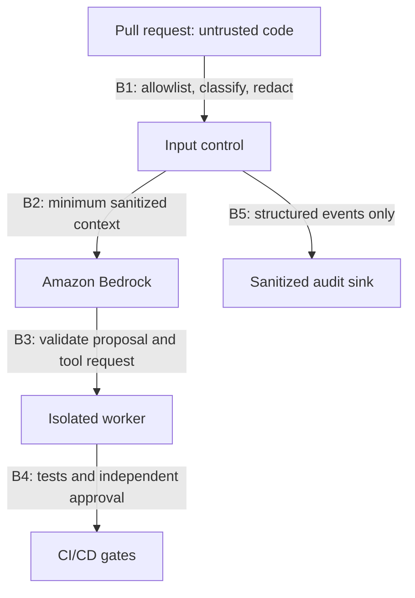

# Chapter 1: Threat-Model the Secure Coding Agent

## What you will build

You will create and validate the security blueprint for Northstar Health Systems' Amazon Bedrock Secure Coding Agent. You will identify valuable assets, callers, system parts, data movement, trust boundaries, threats, controls, safe attack tests, owners, and risks that remain.

The simple lesson is:

> Map the valuables, doors, callers, and forbidden outcomes before choosing controls.

## The five-year-old explanation

Imagine a robot that checks homework. Before using it, we draw the classroom. We mark the box holding private papers, every door, who may enter, and where a stranger might hide a bad instruction. Then we decide what every door must check. We test with pretend papers, never real patient information.

## The healthcare AppSec scenario

A developer opens a pull request containing code that logs a synthetic patient's name, medical-record number, diagnosis, and a fake access token. The agent should identify the unsafe logging pattern. It must not copy the values into a Bedrock prompt, response, patch, audit event, or build artifact.

The secure flow is:

1. Treat the repository and every code comment as untrusted input.
2. Confirm the repository and caller are approved.
3. Detect PHI-, PII-, and secret-like content with deterministic rules before model invocation.
4. Block forbidden data or replace permitted synthetic values with typed placeholders.
5. Send only the minimum necessary sanitized code to an approved model.
6. Validate the model's proposed finding or patch.
7. Run it in an isolated worker with no production access.
8. Require CI/CD security gates and independent human approval.
9. Record structured, sanitized evidence without raw prompts or responses.

## What a threat model is

A threat model is a structured way to answer:

- What are we protecting?
- Who and what can interact with it?
- Where does data move?
- Where does trust change?
- What can go wrong?
- Which control prevents or detects it?
- How will we prove the control works?
- Who owns the remaining risk?

It is not a one-time compliance document. Update it when the model, tool, repository, identity, data type, network path, or deployment process materially changes.

## The system and trust boundaries



A trust boundary is a place where data or authority moves between zones with different trust. A VPC boundary alone is not enough. Every crossing needs identity, authorization, validation, data-handling, and logging decisions appropriate to that flow.

## Assets to protect

| Asset | Why it matters |
|---|---|
| Approved source repositories | Code may reveal business logic and weaknesses. |
| Agent instructions and policies | Tampering can change the agent's behavior. |
| Temporary AWS identity | Theft can grant AWS access. |
| CI/CD and protected branches | Compromise can ship vulnerable software. |
| Sanitized findings and audit evidence | They must support investigation without leaking data. |

Real PHI, real PII, production source, production secrets, and live patient records remain outside this lab.

## STRIDE in simple English

| Category | Plain meaning | Northstar example |
|---|---|---|
| Spoofing | Pretending to be someone else | An unapproved workflow claims to be the approved repository. |
| Tampering | Changing something without permission | The agent edits a protected workflow or test result. |
| Repudiation | Denying an action because proof is missing | A patch cannot be tied to its caller and approval. |
| Information disclosure | Exposing protected information | Patient-like fields or a token appear in a prompt or log. |
| Denial of service | Consuming resources so work stops | A huge file creates excessive model or build use. |
| Elevation of privilege | Gaining more power than allowed | A code comment tricks the agent into deploying to production. |

STRIDE helps teams ask questions. It does not replace privacy analysis, abuse cases, supply-chain review, or testing.

## Commonly confused concepts

| Concept | What it does |
|---|---|
| Threat | Something harmful that could happen. |
| Vulnerability | A weakness that makes the threat possible. |
| Control | A safeguard that prevents, detects, or limits harm. |
| Risk | Likelihood and impact, considering controls. |
| Residual risk | Risk remaining after controls are applied. |
| Bedrock Guardrail | A useful probabilistic content-safety layer, not exact tool authorization or complete PHI/PII protection. |
| IAM policy | Controls AWS API permissions, not whether source-code content is trustworthy. |

## Security requirements produced by the model

- Use synthetic data only in the lab.
- Reject real PHI/PII, production secrets, production code, and live patient data before model invocation.
- Never store raw prompts, completions, or sensitive values in evidence.
- Allow only approved repositories, branches, models, tools, resources, and arguments.
- Treat code, comments, issues, retrieved documents, and model output as untrusted.
- Use temporary workload identities and minimum permissions.
- Generate patches only in isolation.
- Never let the agent approve its own work, bypass a gate, change IAM, or deploy directly to production.
- Require independent review for repository changes.
- Tie each mitigation to a safe negative test and an accountable owner.

## Run the validator

```bash
python3 scripts/validate_threat_model.py \
  --manifest threat-model/threat-model.json \
  --evidence evidence/lab-1-validation.json

python3 -m unittest discover -s tests -v
```

The validator runs offline. It makes no AWS request and invokes no model, agent, tool, repository, Lambda function, or pipeline.

## Safe attack simulations

The manifest defines harmless tests for synthetic PHI-like fields, a fake token, prompt injection in a comment, a production-deployment request, protected-branch access, the wrong repository identity, a broken audit event, and oversized input. Each test states the forbidden side effects that must remain zero.

Chapter 1 defines the contracts. Later chapters implement the runtime, identity, network, RAG, tool, CI/CD, logging, and governance controls.

## Acceptance criteria

| Condition | Expected result |
|---|---|
| Environment changes to production | Fail |
| Required forbidden-data category is removed | Fail |
| Guardrails become the only data control | Fail |
| Asset has no owner or classification | Fail |
| Trust boundary has no checks | Fail |
| Threat lacks mitigation or test | Fail |
| STRIDE category is missing | Fail |
| Abuse test lacks zero-side-effect contract | Fail |
| Real-looking sensitive value enters manifest | Fail |
| Reviewed manifest is unchanged | Pass |

## Evidence checklist

- [ ] System owner and review date
- [ ] Data classifications and explicit forbidden data
- [ ] Actors, components, data flows, and trust boundaries
- [ ] Asset owners
- [ ] STRIDE and healthcare abuse cases
- [ ] Threat likelihood and impact
- [ ] Mitigations mapped to tests
- [ ] Zero-prohibited-side-effect expectations
- [ ] Residual-risk owner and treatment
- [ ] Sanitized validator evidence
- [ ] Independent AppSec, privacy, cloud-security, and platform review

Do not put prompts, source snippets, patient examples, secrets, full AWS account identifiers, or personal contact details in threat-model evidence.

## Exercises

1. Add a future read-only dependency-scanning tool to the diagram. Mark every new trust boundary.
2. Write an abuse case where a package description contains a prompt injection.
3. Explain why IAM permission to invoke Bedrock does not mean the code is safe to send.
4. Add a test contract for an agent proposal that tries to modify its own workflow.

## Knowledge check

1. Why is repository content untrusted even when it comes from an employee?
2. Can a Bedrock Guardrail replace deterministic PHI/PII and secret checks?
3. What is the difference between a threat and a vulnerability?
4. Why must every mitigation have a test?
5. Does Chapter 1 authorize production data or deployment?

### Answers

1. Accounts can be compromised, contributors can make mistakes, and code or dependencies can contain malicious instructions.
2. No. It is one probabilistic layer; Northstar also needs deterministic classification, authorization, minimization, output validation, and human review.
3. A threat is a harmful event; a vulnerability is a weakness that can enable it.
4. Without a test, the team has only a claim, not repeatable evidence.
5. No. It is an offline design and validation exercise using synthetic data.

## Interview-ready explanation

> “I threat-model the Bedrock secure coding agent before granting model or tool access. I identify assets, actors, data flows, and trust boundaries, then use STRIDE and healthcare abuse cases to find threats such as prompt injection, PHI disclosure, identity spoofing, protected-branch tampering, and security-gate bypass. Every threat has an owner, mitigations, safe negative tests, and zero-side-effect expectations. Guardrails are defense in depth, not the only privacy or authorization control. The lab stays non-production and synthetic.”

## Honest limitations

- This validator checks the completeness and internal consistency of the documented design; it cannot prove deployed AWS controls.
- No Bedrock model, agent, Guardrail, IAM role, repository, worker, or pipeline is created or called.
- Threat ratings require Northstar review and may change with architecture and business context.
- A threat model can miss attacks. Architecture review, secure coding, testing, red teaming, monitoring, and incident response remain necessary.
- Passing Chapter 1 does not establish HIPAA compliance or production readiness.

## Current AWS references

- Amazon Bedrock security: https://docs.aws.amazon.com/bedrock/latest/userguide/security.html
- Amazon Bedrock data protection: https://docs.aws.amazon.com/bedrock/latest/userguide/data-protection.html
- Amazon Bedrock IAM: https://docs.aws.amazon.com/bedrock/latest/userguide/security-iam.html
- AWS threat modeling: https://docs.aws.amazon.com/prescriptive-guidance/latest/threat-modeling-for-builders/welcome.html
- AWS generative AI security scoping matrix: https://docs.aws.amazon.com/prescriptive-guidance/latest/strategy-gen-ai-security-scoping-matrix/welcome.html
